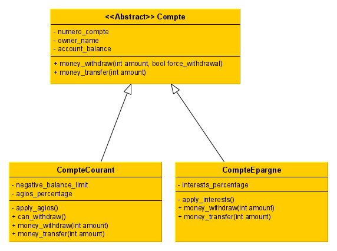

# testez sur le main.py
## Sujet

Ecrire un programme qui implémente en POO un fonctionnement bancaire basique :  

- une classe abstraite `Compte` 
    - **attributs :** numero_compte, nom_proprietaire, solde  
    - **méthodes :** retrait, versement, afficher_solde  

- une classe fille `CompteCourant`, qui ajoute une gestion du découvert (montant maximum négatif 
possible) et des agios (pénalité de X % si le solde est inférieur à zéro) :  
    - **attributs :** autorisation_decouvert, pourcentage_agios  
    - **méthodes :** appliquer_agios  

- une classe fille `CompteEpargne`, qui ajoute :  
    - **attributs :** pourcentage_interets  
    - **méthodes :** appliquer_interets  

 

Le programme doit demander à l’utilisateur le compte concerné (« courant » ou « epargne ») et le montant 
de la transaction (positif pour un versement, négatif pour un retrait)  

Chaque appel de méthode doit afficher le solde avant opération, le détail de l’opération et le solde après 
opération. On suppose pour la simplicité de l’exercice que chaque modification du solde applique les agios 
ou intérêts du compte modifié. 

## Pytest

Des tests unitaires ont été redigés. Un bonus est de les faire passer.

 - Execution de pytest
> pytest

ou

> python -m pytest

Si vous souhaitez executer uniquement ceux marqués par le tag cc:
> python -m pytest -m cc

# Pytest BDD
Vous aurez de plus amples informations sur pytest-bdd ici : [read the docs
](https://pytest-bdd.readthedocs.io/en/latest/)

Un ensemble de __features__ ont été écrites dans le dossier `src/features`
Celles-ci sont executées par le fichier `test_compte_courant_bdd.py`.
# Pylint
Un linter corrige plutôt le forme de votre code et non le fond.
Vous permettant de rédiger un code __dans les règles de l'art__.

> python -m pylint compte.py
> pylint compte.py

# Coverage
Afin de pouvoir visualiser correctement votre état d'avancement de tests.

> python -m coverage run -m pytest -m cc
> python -m coverage report

> pytest && coverage html
